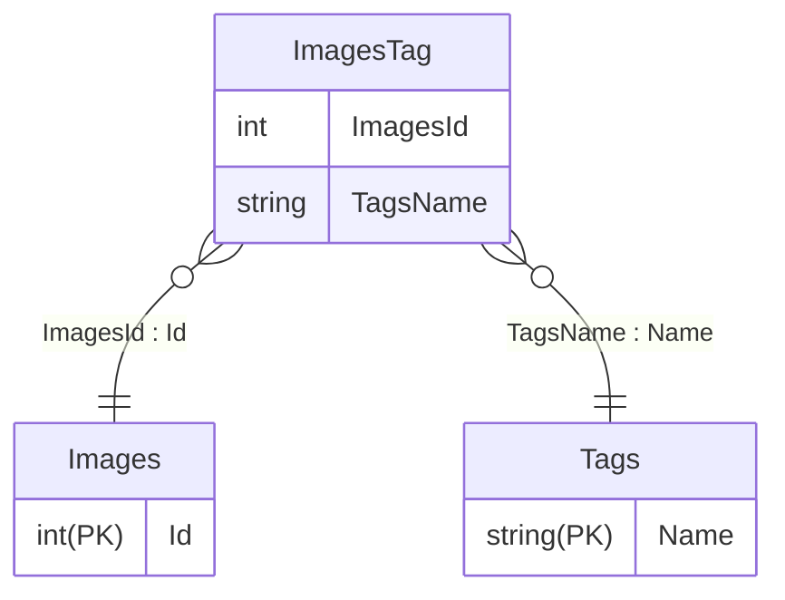
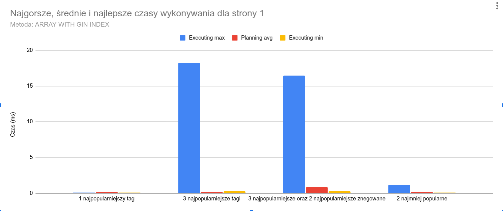
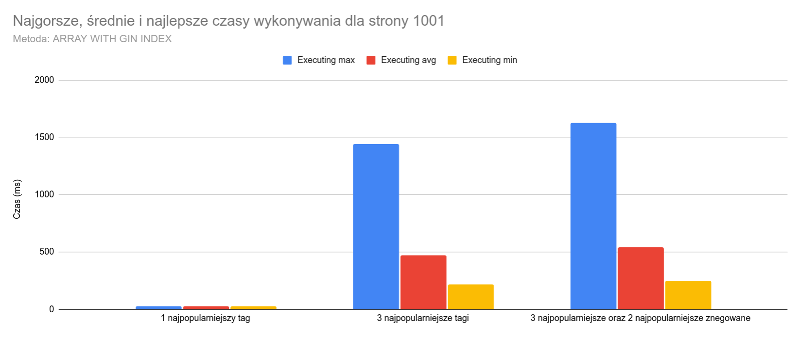
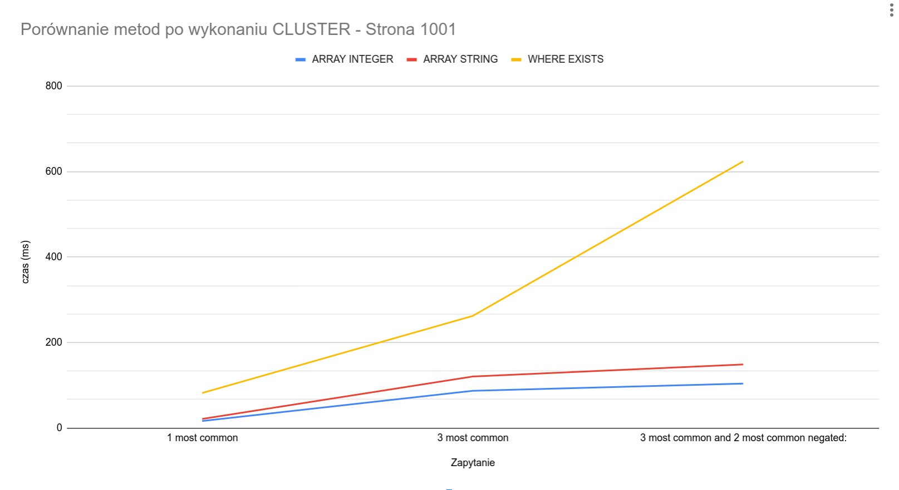
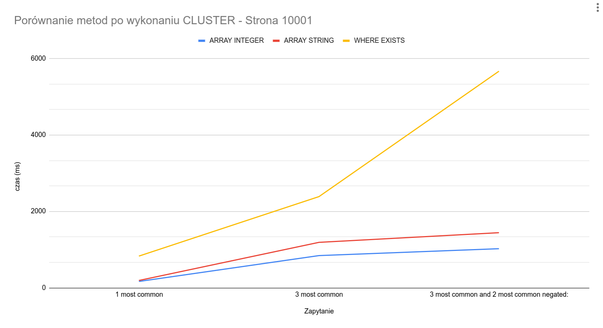
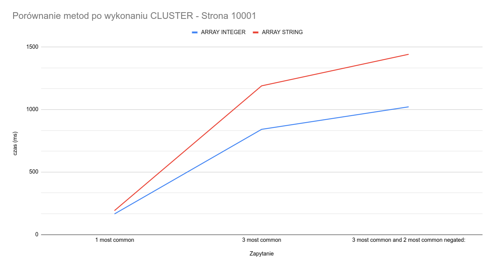

# Optymalizacja szukania po tagach z paginacją w PostgreSQL

Zazwyczaj nie przejmowałem się zbytnio wydajnością kodu, który piszę, gdyż appki, za których robienie się brałem, nie były przeznaczone do pracy z dużą ilością danych. Z moim obecnym projektem jest jednak inaczej. Tworzę Nextbooru - *taggable-image board*. Jest to appka, która ma przechowywać obrazki i pozwalać je **szybko** wyszukiwać po tagach. Spędziłem kilka dni testując różne rozwiązania i szukając szybszych, jak i bawiąc się ustawieniami postgresa. Zaczynajmy!

> Note: wyszukiwanie po tagach działa w taki sposób, że szukamy obrazków, które mają wszystkie tagi w zapytaniu oraz nie mają takich, które wykluczyliśmy. Przykładowo dla wyszukania: `tag1 tag2 !tag3` musimy znaleźć obrazki które zawierają `tag1` **i** `tag2` **oraz** nie zawierają `tag3`.

## Struktura tabel, dane testowe i założenia
*Dla przejrzystości pominąłem nieistotne kolumny, które miałem już w projekcie*

Zaczynamy z taką strukturą tabel:

Testowe dane:
- Images: **10 milionów** rekordów
- Tags: **40 tysięcy** rekordów
- ImageTag: Około **180 milionów** rekordów
- Tagi zostały rozmieszone w taki sposób, że jedne są bardziej popularne, a inne są tylko na kilku obrazkach.

Jeżeli nie chce Ci się czytać wszystkiego, to najlepszy sposób opisany jest w [TL;DR;](#tldr)

<details>
    <summary>Założenia, sprzęt testowy i wersja postgresa</summary>

Założenia:
- Wyniki są poddane paginacji
- Jest możliwy losowy dostęp do danej strony
- Rozmiar strony to 20 elementów
- Każda metoda będzie testowana dla:
    * jednego najpopularniejszego taga
    * trzech najpopularniejszych tagów
    * trzech najpopularniejszych i dwóch najpopularniejszych, których obrazek ma nie mieć
    * dwóch najmniej popularnych
- Każde zapytanie będzie wykonywane 5 razy, brany jego najlepszy czas, najgorszy i średnią
- Paginacja będzie testowana dla stron: 1, 101, 1001, 10001 za wyjątkiem dwóch najmniej popularnych tagów.

Sprzęt testowy:
- CPU: AMD Ryzen 5 5500, podkręcony do 4341MHz
- RAM: Patriot Viper Steel, DDR4, 2x16 GB, 3600MHz, CL18 (Running at 3200MT/s)
- SSD: Lexar NM620 1TB

Postgres:
- Domyślne ustawienia, dla testów wyłączone memoization
- Docker container: "postgres:16-alpine"

</details>


## Najprotsze sposoby

### WHERE EXISTS
Najprostszy sposób na który wpadłem to użycie `WHERE EXISTS` oraz `WHERE NOT EXISTS`

```sql
SELECT * FROM "Images"
WHERE EXISTS (SELECT "TagsName" FROM "ImageTag" WHERE "ImagesId" = "Images"."Id" AND "TagsName" = 'tag1')
AND EXISTS (SELECT "TagsName" FROM "ImageTag" WHERE "ImagesId" = "Images"."Id" AND "TagsName" = 'tag2')
AND NOT EXISTS (SELECT "TagsName" FROM "ImageTag" WHERE "ImagesId" = "Images"."Id" AND "TagsName" = 'tag3')
ORDER BY "Id"
LIMIT 20;
```

A oto wyniki:

<table>
<thead>
  <tr>
    <th>Zapytanie</th>
    <th>Strona<br></th>
    <th>Średnia wykonywania<br></th>
    <th>Średnia planowania<br></th>
    <th>Max wykonywania</th>
    <th>Max planowania</th>
    <th>Min wykonywania</th>
    <th>Min planowania<br></th>
  </tr>
</thead>
<tbody>
  <tr>
    <td rowspan="4">1 najpopularniejszy tag</td>
    <td>1</td>
    <td>0,1046</td>
    <td>0,2844</td>
    <td>0,126</td>
    <td>0,334</td>
    <td>0,098</td>
    <td>0,256</td>
  </tr>
  <tr>
    <td>101</td>
    <td>2,8824</td>
    <td>0,3034</td>
    <td>3,846</td>
    <td>0,373</td>
    <td>2,529</td>
    <td>0,254</td>
  </tr>
  <tr>
    <td>1001</td>
    <td>22,5972</td>
    <td>0,2678</td>
    <td>26,264</td>
    <td>0,298</td>
    <td>21</td>
    <td>0,254</td>
  </tr>
  <tr>
    <td>10001</td>
    <td>271,1666</td>
    <td>0,3092</td>
    <td>304,302</td>
    <td>0,349</td>
    <td>260,952</td>
    <td>0,262</td>
  </tr>
  <tr>
    <td rowspan="4">3 najpopularniejsze tagi</td>
    <td>1</td>
    <td>0,4784</td>
    <td>1,4354</td>
    <td>0,541</td>
    <td>1,678</td>
    <td>0,43</td>
    <td>1,297</td>
  </tr>
  <tr>
    <td>101</td>
    <td>25,11</td>
    <td>1,3582</td>
    <td>27,502</td>
    <td>1,443</td>
    <td>23,869</td>
    <td>1,256</td>
  </tr>
  <tr>
    <td>1001</td>
    <td>246,4882</td>
    <td>1,2856</td>
    <td>259,494</td>
    <td>1,417</td>
    <td>234,199</td>
    <td>1,239</td>
  </tr>
  <tr>
    <td>10001</td>
    <td>2683,7552</td>
    <td>1,4086</td>
    <td>2742,22</td>
    <td>1,644</td>
    <td>2653,033</td>
    <td>1,165</td>
  </tr>
  <tr>
    <td rowspan="3">3 najpopularniejsze oraz 2 najpopularniejsze znegowane</td>
    <td>1</td>
    <td>1,1674</td>
    <td>2,4062</td>
    <td>1,273</td>
    <td>2,762</td>
    <td>1,079</td>
    <td>2,247</td>
  </tr>
  <tr>
    <td>101</td>
    <td>83,2016</td>
    <td>2,0858</td>
    <td>84,987</td>
    <td>2,256</td>
    <td>80,513</td>
    <td>1,984</td>
  </tr>
  <tr>
    <td>1001</td>
    <td>1531,4836</td>
    <td>2,1194</td>
    <td>3212,661</td>
    <td>2,309</td>
    <td>1089,696</td>
    <td>2,007</td>
  </tr>
  <tr>
    <td>2 najmniej popularne</td>
    <td>1</td>
    <td>20,3318</td>
    <td>49,2698</td>
    <td>24,846</td>
    <td>243,888</td>
    <td>19,04</td>
    <td>0,539</td>
  </tr>
</tbody>
</table>


> Tak, napisałem na wykresach "czas' zamiast "czasy", nie chce mi się wrzucać nowych obrazków, serio.

Jak widać, o ile dla pierwszych stron czas jest akceptowalny, tak dla wyższych stron czas rośnie bardzo szybko. Przy wyszukiwaniu 3 pasujących oraz 2 niepasujących tagów dla strony 10001 czas wykonywania przewyższył 60 sekund. Więc o ile dla pierwszych stron czas jeszcze jest akceptowalny, tak dla wyższych stron jest nieakceptowalny. Potrzebny jest szybszy sposób.

### WHERE (SELECT COUNT(*) ... IN (tags)) = tagsCount
Drugi sposób, który przyszedł mi do głowy, to użycie takiego oto zapytania:

```sql
SELECT * FROM "Images"
    WHERE (SELECT COUNT(*) FROM "ImageTag" WHERE "ImagesId" = "Images"."Id" AND "TagsName" IN ('tag1', 'tag2')) = 2
    ORDER BY "Id"
    OFFSET 0 * 20
    LIMIT 20;
```


Szybko go odrzuciłem, gdyż wydawał mi się strasznie wolny. Mamy tutaj zagnieżdżone zapytanie z COUNT, to nie miało prawa być szybkie.
Nie będę robił dla niego testów, oto `EXPLAIN ANALYZE` do zapytania powyżej, `tag1` oraz `tag2` są **najmniej popularnymi tagami**:
```
Limit  (cost=0.43..44668.32 rows=20 width=807) (actual time=71279.852..71279.853 rows=0 loops=1)
"  ->  Index Scan using ""PK_Images"" on ""Images""  (cost=0.43..113869607.57 rows=50985 width=807) (actual time=71279.852..71279.852 rows=0 loops=1)"
        Filter: ((SubPlan 1) = 2)
        Rows Removed by Filter: 10190959
        SubPlan 1
          ->  Aggregate  (cost=9.17..9.18 rows=1 width=8) (actual time=0.003..0.003 rows=1 loops=10190959)
"                ->  Index Only Scan using ""PK_ImageTag"" on ""ImageTag""  (cost=0.57..9.17 rows=1 width=0) (actual time=0.003..0.003 rows=0 loops=10190959)"
"                      Index Cond: ((""ImagesId"" = ""Images"".""Id"") AND (""TagsName"" = ANY ('{tag1,tag2}'::text[])))"
                      Heap Fetches: 0
Planning Time: 0.125 ms
Execution Time: 71279.911 ms
```

Odpaliłem go kilka razy, żeby baza mogła zbuforować sobie, a i tak dla pierwszej strony miałem tutaj czas ponad 60 sekund. Dla najpopularniejszych tagów dla pierwszej strony czas wykonywania wyniósł około 2ms, ale ze względu na działanie przy najmniej popularnych tagach jest to nieakceptowalne. Ktoś mógłby bardzo łatwo zrobić atak DoS na nasz serwer odpalając kilka takich wyszukiwań jednocześnie.

## Full text search
W poszukiwaniu szybszego wpadłem na pomysł użycia full text searcha z indeksem GIN.
Dodałem kolumnę `TagsStr` o typie `text`. Następnie dodałem dane do kolumny tym zapytaniem:
```sql
UPDATE "Images"
    SET "TagsStr" = (SELECT string_agg("TagsName", ' ')
                     FROM "ImageTag"
                     WHERE "ImagesId" = "Images"."Id"
                     GROUP BY "ImagesId");
```
Oraz utworzyłem indeks GIN na `tsvector` kolumny `TagsStr`:
```sql
CREATE INDEX tags_str_idx ON "Images" USING GIN(to_tsvector('simple', "TagsStr"));
```

A zatem oto przykładowe zapytanie:
```sql
SELECT * FROM "Images"
    WHERE to_tsvector('simple', "TagsStr") @@ to_tsquery('simple', 'tag1 & tag2 & tag3')
    ORDER BY "Id"
    OFFSET 0 * 20
    LIMIT 20;
```

Zrobiłem tylko kilka testów i okazało się, że full text search nie nadaje się do tego, jest od 4 do 20x wolniejszy niż metoda z WHERE EXISTS.

## Tablice postgresa oraz indeks GIN
Postanowiłem przeszukać internet w poszukiwaniu szybszego sposobu wyszukiwania obrazków po tagach. Wydawało mi się, że musi być coś, co pozwoli mi zrobić to wydajniej. Znalazłem takiego oto blog posta: [http://www.databasesoup.com/2015/01/tag-all-things.html](http://www.databasesoup.com/2015/01/tag-all-things.html).

Tablice hmm, może to mieć sens. A więc dodałem tablicę na tagi:
```sql
ALTER TABLE "Images" ADD COLUMN "TagsArr" text[] NOT NULL DEFAULT '{}';
```
Wrzuciłem do niej dane:
```sql
UPDATE "Images"
    SET "TagsStr" = (SELECT array_agg("TagsName")
                     FROM "ImageTag"
                     WHERE "ImagesId" = "Images"."Id"
                     GROUP BY "ImagesId");
```
Poszedłem na spacerek, gdyż trwało to 3h, a następnie utworzyłem indeks GIN:

```sql
CREATE INDEX tags_index ON "Images" USING GIN ("TagsArr");
```

I mogłem rozpocząć testy! Przykładowe zapytanie:
```sql
SELECT "Id" FROM "Images"
                WHERE "TagsArr" @> array['tag1', 'tag2', 'tag3']
                  AND NOT "TagsArr" @> array['tag4', 'tag5']
                ORDER BY "Id"
                OFFSET 0 LIMIT 20;
```

> Note: operator `@>` oznacza "zawiera", to samo co w np. C# `array.Contains`

Oto wyniki:
<table>
<thead>
  <tr>
    <th>Zapytanie</th>
    <th>Strona<br></th>
    <th>Średnia wykonywania<br></th>
    <th>Średnia planowania<br></th>
    <th>Max wykonywania</th>
    <th>Max planowania</th>
    <th>Min wykonywania</th>
    <th>Min planowania<br></th>
  </tr>
</thead>
<tbody>
  <tr>
    <td rowspan="4">1 najpopularniejszy tag</td>
    <td>1</td>
    <td>0,0774</td>
    <td>0,1964</td>
    <td>0,083</td>
    <td>0,214</td>
    <td>0,073</td>
    <td>0,187</td>
  </tr>
  <tr>
    <td>101</td>
    <td>2,861</td>
    <td>0,211</td>
    <td>2,957</td>
    <td>0,221</td>
    <td>2,774</td>
    <td>0,2</td>
  </tr>
  <tr>
    <td>1001</td>
    <td>26,8312</td>
    <td>0,2088</td>
    <td>30,137</td>
    <td>0,255</td>
    <td>25,743</td>
    <td>0,19</td>
  </tr>
  <tr>
    <td>10001</td>
    <td>713,8932</td>
    <td>0,2274</td>
    <td>1958,206</td>
    <td>0,259</td>
    <td>394,756</td>
    <td>0,208</td>
  </tr>
  <tr>
    <td rowspan="4">3 najpopularniejsze tagi</td>
    <td>1</td>
    <td>3,895</td>
    <td>0,1978</td>
    <td>18,277</td>
    <td>0,218</td>
    <td>0,296</td>
    <td>0,187</td>
  </tr>
  <tr>
    <td>101</td>
    <td>147,2726</td>
    <td>0,2112</td>
    <td>666,045</td>
    <td>0,259</td>
    <td>16,188</td>
    <td>0,195</td>
  </tr>
  <tr>
    <td>1001</td>
    <td>474,0946</td>
    <td>0,2514</td>
    <td>1442,028</td>
    <td>0,41</td>
    <td>220,305</td>
    <td>0,207</td>
  </tr>
  <tr>
    <td>10001</td>
    <td>5262,543</td>
    <td>0,2048</td>
    <td>5948,61</td>
    <td>0,24</td>
    <td>2821,232</td>
    <td>0,164</td>
  </tr>
  <tr>
    <td rowspan="4">3 najpopularniejsze oraz 2 najpopularniejsze znegowane</td>
    <td>1</td>
    <td>3,505</td>
    <td>0,8576</td>
    <td>16,461</td>
    <td>3,03</td>
    <td>0,262</td>
    <td>0,307</td>
  </tr>
  <tr>
    <td>101</td>
    <td>145,8538</td>
    <td>0,2766</td>
    <td>656,075</td>
    <td>0,286</td>
    <td>18,043</td>
    <td>0,269</td>
  </tr>
  <tr>
    <td>1001</td>
    <td>543,7584</td>
    <td>0,2696</td>
    <td>1630,871</td>
    <td>0,308</td>
    <td>249,044</td>
    <td>0,238</td>
  </tr>
  <tr>
    <td>10001</td>
    <td>3337,4148</td>
    <td>0,2722</td>
    <td>5214,295</td>
    <td>0,321</td>
    <td>2857,027</td>
    <td>0,238</td>
  </tr>
  <tr>
    <td>2 najmniej popularne</td>
    <td>1</td>
    <td>0,3218</td>
    <td>0,1816</td>
    <td>1,149</td>
    <td>0,204</td>
    <td>0,096</td>
    <td>0,169</td>
  </tr>
</tbody>
</table>





Pierwsze co się rzuca w oczy to ten duży najgorszy czas wykonywania, jak baza danych jeszcze nie zbuforowała sobie danych. Ale i tak widać mocną poprawę, o ile jeszcze dla strony pierwszej nie jest to jakoś imponujące, tak dla strony 1001 mamy już znaczne różnice. Możemy zauważyć, że ta metoda skaluje się znacznie lepiej niż WHERE EXISTS. Niestety, to dalej jest sporo czasu, tym badziej jak sporzymy na stronę 10001 w tabelce, najlepszy czas wykonywania 2857ms dla najbardziej złożonego przypadku. Tragedia! Aczkolwiek nie aż taka jak ponad 60s w metodzie WHERE EXISTS. Ale spokojnie, jest jeszcze kilka rzeczy, które można tu zrobić. Skupimy się teraz na optymalizacji metody z tablicami dla stron 1001 oraz 10001, bo jest to najszybsza metoda, a wyższe strony są najbardziej problematyczne. W podsumowaniu porównam wszystkie metody już po tych optymalizacjach, bo niektóre wpłyną na wszystkie metody.

## Optymalizacje wyszukiwania tagów na tablicy
### Użycie liczb zamiast stringów
> Note: nazwiemy tę metodę ARRAY INTEGER

Pierwsze co mi wpadło do głowy to: "Hej! Przecież komputery są szybsze w porównywaniu liczb niż stringów". Więc przypisałem do każdego Taga liczbę, dodałem tablicę typu `integer[]` na tabelę obrazków, tak samo jak tablicę z tagami w stringach, zaktualizowałem dane, utworzyłem indeks GIN i przetestowałem pobieżnie takie oto zapytanie:
```sql
EXPLAIN ANALYZE SELECT * FROM "Images"
                WHERE "TagsArrNum" @> array[11315, 4814, 26366]
                AND NOT "TagsArrNum" @> array[21060, 24474]
                ORDER BY "Id"
                OFFSET 10000 * 20
                    LIMIT 20;
```

Czas wyszedł mi około **2100ms** dla strony 10001, więc jest dobrze. Poprawa o 25% jest już czymś.

### Cluster tabeli
2100ms to dalej dużo, ale co jeszcze można zrobić. Spójrzmy sobie na execution plan dla zapytania powyżej:
```
Limit  (cost=1385620.49..1385622.82 rows=20 width=807) (actual time=2109.010..2156.263 rows=20 loops=1)
  ->  Gather Merge  (cost=1362285.53..1459310.90 rows=831588 width=807) (actual time=1989.882..2099.354 rows=200020 loops=1)
        Workers Planned: 2
        Workers Launched: 2
        ->  Sort  (cost=1361285.50..1362324.99 rows=415794 width=807) (actual time=1971.461..1990.006 rows=66724 loops=3)
"              Sort Key: ""Id"""
              Sort Method: external merge  Disk: 257848kB
              Worker 0:  Sort Method: external merge  Disk: 239288kB
              Worker 1:  Sort Method: external merge  Disk: 239680kB
"              ->  Parallel Seq Scan on ""Images""  (cost=0.00..1026870.47 rows=415794 width=807) (actual time=63.957..1306.840 rows=335100 loops=3)"
"                    Filter: ((""TagsArrNum"" @> '{11315,4814,26366}'::integer[]) AND (NOT (""TagsArrNum"" @> '{21060,24474}'::integer[])))"
                    Rows Removed by Filter: 3061887
Planning Time: 0.122 ms
JIT:
  Functions: 8
"  Options: Inlining true, Optimization true, Expressions true, Deforming true"
"  Timing: Generation 1.079 ms, Inlining 94.273 ms, Optimization 89.224 ms, Emission 58.311 ms, Total 242.887 ms"
Execution Time: 2199.202 ms
```

Wygląda on na trochę skomplikowany, mamy tutaj seq scan na tabeli obrazków, sortowanie z użyciem dysku, miałem wrażenie że to sortowanie jest największym problem tutaj. Ale chwila, sortujemy po indeksie, nie można tego jakoś zoptymalizować? Jakby tylko była możliwość posortowania danych na dysku, żeby baza nie musiała sortować w zapytaniu... Okazuje się, że jest! Poznajcie [CLUSTER](https://www.postgresql.org/docs/current/sql-cluster.html)!

CLUSTER sortuje nam tabelę na dysku według wybranego indeksu, robi się to tak:
```sql
CLUSTER "Images" USING "PK_Images";
ANALYZE; -- odpalamy ANALYZE, bo inaczej query planner nie będzie wiedział o istnieniu klastra i nie wykorzysta go
```
Ta operacja może zająć trochę czasu.
> UWAGA! Operacja CLUSTER ***BLOKUJE CAŁKOWICIE*** tabelę w trakcie jej trwania, więc nie róbcie tego na aktualnie używanej bazie w produkcji.

> Note: Baza nie będzie utrzymywała klastra automatycznie. Z dokumentacji postgresa: *Clustering is a one-time operation: when the table is subsequently updated, the changes are not clustered. That is, no attempt is made to store new or updated rows according to their index order. (If one wishes, one can periodically recluster by issuing the command again. Also, setting the table's fillfactor storage parameter to less than 100% can aid in preserving cluster ordering during updates, since updated rows are kept on the same page if enough space is available there.)*
>
> Polecam także zapoznać się z dokumentacją, aby usprawnić operację klastrowania tabeli.

Oto query plan dla tego samego zapytania po zakończeniu klastrowania:
```
Limit  (cost=251027.74..251052.84 rows=20 width=807) (actual time=1071.101..1071.245 rows=20 loops=1)
"  ->  Index Scan using ""PK_Images"" on ""Images""  (cost=0.43..1278812.57 rows=1018863 width=807) (actual time=0.052..1061.703 rows=200020 loops=1)"
"        Filter: ((""TagsArrNum"" @> '{11315,4814,26366}'::integer[]) AND (NOT (""TagsArrNum"" @> '{21060,24474}'::integer[])))"
        Rows Removed by Filter: 1827376
Planning Time: 0.971 ms
JIT:
  Functions: 4
"  Options: Inlining false, Optimization false, Expressions true, Deforming true"
"  Timing: Generation 0.250 ms, Inlining 0.000 ms, Optimization 0.210 ms, Emission 3.569 ms, Total 4.029 ms"
Execution Time: 1071.545 ms
```

Prawie dwukrotnie niższy czas wykonywania!

### Współbieżność - modyfikacja ustawień postgresa
> UWAGA! Wszekie modyfikacji konfiguracji za pomocą `SET` działają tylko w obrębie danej sesji. Aby ustawić je na stałe trzeba zmodyfikować plik `postgresql.conf` znajdujący się w katalogu danych albo w inny sposób opisany [tutaj](https://www.postgresql.org/docs/current/config-setting.html).

Da się zejść jeszcze niżej modyfikując ustawienia postgresa. Zmniejszmy koszt współbieżności 5x:
```sql
SET parallel_tuple_cost = 0.02;
```

Teraz dla powyższego omawianego w naszych optymalizacjach zapytania query plan wygląda tak:
```
Limit  (cost=240805.38..240829.36 rows=20 width=807) (actual time=551.257..558.841 rows=20 loops=1)
  ->  Gather Merge  (cost=1000.46..1222642.24 rows=1018863 width=807) (actual time=23.041..549.772 rows=200020 loops=1)
        Workers Planned: 2
        Workers Launched: 2
"        ->  Parallel Index Scan using ""PK_Images"" on ""Images""  (cost=0.43..1189624.64 rows=424526 width=807) (actual time=3.543..422.385 rows=66696 loops=3)"
"              Filter: ((""TagsArrNum"" @> '{11315,4814,26366}'::integer[]) AND (NOT (""TagsArrNum"" @> '{21060,24474}'::integer[])))"
              Rows Removed by Filter: 609349
Planning Time: 0.132 ms
JIT:
  Functions: 8
"  Options: Inlining false, Optimization false, Expressions true, Deforming true"
"  Timing: Generation 1.179 ms, Inlining 0.000 ms, Optimization 0.856 ms, Emission 11.487 ms, Total 13.522 ms"
Execution Time: 559.185 ms
```

Ucięliśmy czas praktycznie na połowę, da się jeszcze niżej? Cóż, można zwiększyć maksymalną ilość workerów, którą postgres może odpalić dla zapytania. Domyślnie są dwa, zwiększmy do 4
```sql
SET max_parallel_workers_per_gather = 4;
```

Wynik już nie jest tak imponujący:
```
Limit  (cost=236540.28..236563.83 rows=20 width=807) (actual time=389.963..397.612 rows=20 loops=1)
  ->  Gather Merge  (cost=1000.49..1200914.34 rows=1018863 width=807) (actual time=24.237..388.928 rows=200020 loops=1)
        Workers Planned: 4
        Workers Launched: 4
"        ->  Parallel Index Scan using ""PK_Images"" on ""Images""  (cost=0.43..1164142.37 rows=254716 width=807) (actual time=4.327..305.364 rows=40051 loops=5)"
"              Filter: ((""TagsArrNum"" @> '{11315,4814,26366}'::integer[]) AND (NOT (""TagsArrNum"" @> '{21060,24474}'::integer[])))"
              Rows Removed by Filter: 365875
Planning Time: 0.134 ms
JIT:
  Functions: 12
"  Options: Inlining false, Optimization false, Expressions true, Deforming true"
"  Timing: Generation 2.153 ms, Inlining 0.000 ms, Optimization 1.362 ms, Emission 19.895 ms, Total 23.410 ms"
Execution Time: 398.031 ms
```

Dużo czasu procesora jest marnowane na overhead związany z współbieżnością, na dodatek im niższa strona tym mniejszy zysk wydajności. Ogólnie ja zostanę raczej przy takich ustawieniach:
```sql
SET parallel_tuple_cost = 0.04;
SET parallel_setup_cost = 1000;          -- default
SET max_parallel_workers_per_gather = 2; -- default
```
Myślę, że to jest dobry balans pomiędzy szybkością działania paginacji, a oszczędzaniem zasobów.

Zapoznajcie się z dokumentacją postgresa, jeżeli chodzi o współbieżność:
- [https://www.postgresql.org/docs/16/parallel-query.html](https://www.postgresql.org/docs/16/parallel-query.html)
- [https://www.postgresql.org/docs/16/runtime-config-resource.html#RUNTIME-CONFIG-RESOURCE-ASYNC-BEHAVIOR](https://www.postgresql.org/docs/16/runtime-config-resource.html#RUNTIME-CONFIG-RESOURCE-ASYNC-BEHAVIOR)
- [https://www.postgresql.org/docs/16/runtime-config-query.html#GUC-PARALLEL-SETUP-COST](https://www.postgresql.org/docs/16/runtime-config-query.html#GUC-PARALLEL-SETUP-COST)

### Wyłączenie JIT
Przetestujcie sobie czy warto, dla mnie nie ma różnicy, jedynie przy bardzo wysokich offsetach jak `OFFSET 2000000` JIT spowalniał mocno. Ja go raczej wyłączę.

## Podsumowanie wyników
> Note: Dla tego podsumowania wykonałem tylko po jednym teście, a nie jak wcześniej pięciu.

Porównajmy sobie 3 główne metody tutaj omawiane dla stron 1001 oraz 10001, po wykonaniu CLUSTER, na ***domyślnych*** ustawieniach bazy




Jak widać, metody z tablicami skalują się znacznie lepiej wraz ze złożonością zapytania, są ogólnie szybsze, a liczb zamiast stringów na tablicy poprawia dosyć znacznie wydajność. Na wykresie nie widać tego dobrze, więc jeszcze jeden wykres dla strony 10001 porównujący tylko te tablice:


Do tego zmniejszamy koszt współbieżności do możemy zejść poniżej 600ms dla strony 10001.

Czy to wszystko? Czy nie można jeszcze bardziej zoptymalizować paginacji? Cóż, ja nie znam takiego sposobu, mam wrażenie że dotarłem tutaj do limitu. Sporo serwisów limituje maksymalną stronę, Google pozwala przejrzeć ograniczoną ilość wyników, jeszcze inne serwisy stosują *infinite scrolling*, gdzie można wykorzystać dzielenie wyników bazując na ID, tj.
```sql
SELECT * FROM "Images" WHERE "Id" > @last_id AND (...) ORDER BY "Id" LIMIT 20;
```
to wykorzystuje indeks i jest bardzo szybkie, czas wykonywania spada do ułamka milisekundy. Więc moja rada, to korzystanie z sekwencyjnej paginacji gdzie tylko się da. Użytkownik klika przycisk "następna strona" to wyszukać następną stronę metodą `OFFSET LIMIT` można użyć po prostu ostatniego Id z wyników i zwrócić następne. That's it.

## TL;DR;
* Przypisz do każdego taga liczbę, może to byc w sumie primary key
* Dodaj na tagowaną tabelę columnę typu `integer[]` (postgresowa tablica)
* Dodaj indeks GIN dla tej kolumny:
  ```sql
  CREATE INDEX tags_index ON "Images" USING GIN ("TagsArr");
  ```
* Wyszukujesz po niej tak:
  ```sql
  SELECT * FROM "Images"
                WHERE "TagsArr" @> array[11315, 4814, 26366]
                AND NOT "TagsArr" @> array[21060, 24474]
                ORDER BY "Id"
                OFFSET (@page - 1) * 20
                LIMIT 20;
  ```
* Dla szybszej paginacji z sortowaniem po indeksie możesz zrobić CLUSTER tabeli, przykład dla primary keya:
  ```sql
  CLUSTER "Images" USING "PK_Images";
  ANALYZE; -- odpalamy ANALYZE, bo inaczej query planner nie będzie wiedział o istnieniu klastra i nie wykorzysta go
  ```
* Zmniejsz koszt współbieżności, żeby Postgres wykorzystał więcej wątków, najoptymalniejsze są dwa dla Gather:
  ```sql
  SET parallel_tuple_cost = 0.04;
  ```
* (Może dawać różne wyniki) Wyłącz JIT:
  ```sql
  SET jit = off;
  ```
* Używaj sekwencyjnej paginacji gdzie się da:
  ```sql
  SELECT * FROM "Images" WHERE "Id" > @last_id AND (...) ORDER BY "Id" LIMIT 20;
  SELECT * FROM "Images" WHERE "Id" < @last_id AND (...) ORDER BY "Id" DESC LIMIT 20;
  ```

> UWAGA! Wszekie modyfikacji konfiguracji za pomocą `SET` działają tylko w obrębie danej sesji. Aby ustawić je na stałe trzeba zmodyfikować plik `postgresql.conf` znajdujący się w katalogu danych albo w inny sposób opisany [tutaj](https://www.postgresql.org/docs/current/config-setting.html).

## Dane
Dane z testów użyte do artykułu znajdują się [tutaj](https://github.com/ScuroGuardiano/scuroguardiano-docs/tree/master/assets/postgres-searching-by-tags/data).

## Bonus: głupi pomysł z liczbami pierwszymi
Po drodze wpadłem jeszcze na pomysł, żeby każdemu tagowi przypisać kolejną liczbę pierwszą, liczyć ich iloczyn i na kolumnie o typie `NUMERIC` w obrazkach zapisywać ją. Potem, żeby znaleźć pasujące tagi wystarczyło zrobić `WHERE TagsPrimeProduct % (@tagprime1 * @tagprime2 * @tagprime3) = 0`. W mojej głowie to była operacja O(1), aczkolwiek nie uwzględniłem tego, że:
- operacje na kolumnie `NUMERIC` nie są tak szybkie jak na zwykłych 32 i 64-bitowych liczbach, aczkolwiek WHERE EXISTS też nie jest szybkie, więc kij z tym.
- Nie da się tu użyć indeksu - to skazało z góry ten pomysł na porażkę. Znaczy możnaby stworzyć indeks pod tę kolumnę, ale i tak indeks musiałby być skanowany sekwencyjnie, a dla 10mln rekordów to w najgorszym przypadku 10mln takich obliczeń.