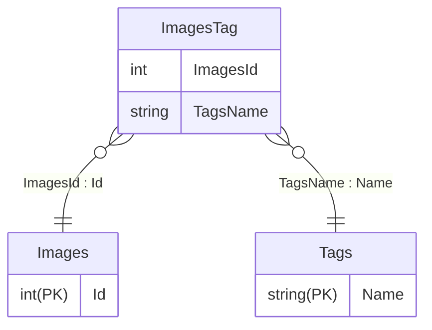
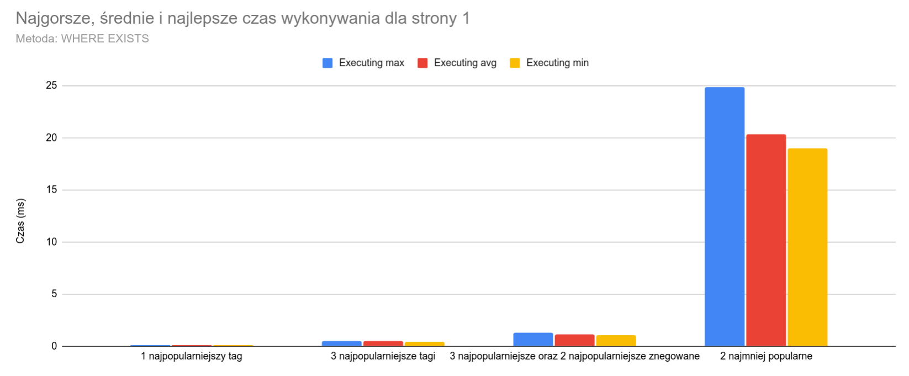
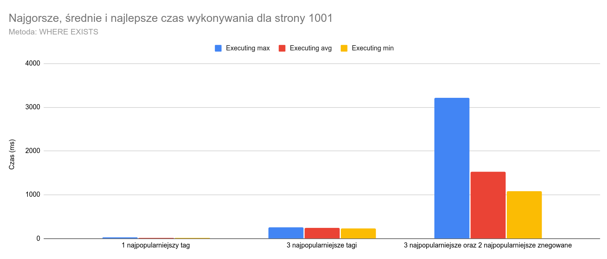

# DOKUMENT W TRAKCIE PISANIA

---

# Optymalizacja szukania po tagach w PostgreSQL

Zazwyczaj nie przejmowałem się zbytnio wydajnością kodu, który piszę, gdyż appki, za których robienie się brałem, nie były przeznaczone do pracy z dużą ilością danych. Z moim obecnym projektem jest jednak inaczej. Tworzę Nextbooru - *taggable-image board*. Jest to appka, która ma przechowywać obrazki i pozwalać je **szybko** wyszukiwać po tagach. Spędziłem kilka dni testując różne rozwiązania i szukając szybszych, jak i bawiąc się ustawieniami postgresa. Zaczynajmy!

> Note: wyszukiwanie po tagach działa w taki sposób, że szukamy obrazków, które mają wszystkie tagi w zapytaniu oraz nie mają takich, które wykluczyliśmy. Przykładowo dla wyszukania: `tag1 tag2 !tag3` musimy znaleźć obrazki które zawierają `tag1` **i** `tag2` **oraz** nie zawierają `tag3`.

## Struktura tabel, dane testowe i założenia
*Dla przejrzystości pominąłem nieistotne kolumny, które miałem już w projekcie*

Zaczynamy z taką strukturą tabel:

Testowe dane:
- Images: **10 milionów** rekordów
- Tags: **40 tysięcy** rekordów
- ImageTag: Około **180 milionów** rekordów
- Tagi zostały rozmieszone w taki sposób, że jedne są bardziej popularne, a inne są tylko na kilku obrazkach.

<details>
    <summary>Założenia, sprzęt testowy i wersja postgresa</summary>

Założenia:
- Wyniki są poddane paginacji
- Jest możliwy losowy dostęp do danej strony
- Rozmiar strony to 20 elementów
- Każda metoda będzie testowana dla:
    * jednego najpopularniejszego taga
    * trzech najpopularniejszych tagów
    * trzech najpopularniejszych i dwóch najpopularniejszych, których obrazek ma nie mieć
    * dwóch najmniej popularnych
- Każde zapytanie będzie wykonywane 5 razy, brany jego najlepszy czas, najgorszy i średnią
- Paginacja będzie testowana dla stron: 1, 101, 1001, 10001 za wyjątkiem dwóch najmniej popularnych tagów.

Sprzęt testowy:
- CPU: AMD Ryzen 5 5500, podkręcony do 4341MHz
- RAM: Patriot Viper Steel, DDR4, 2x16 GB, 3600MHz, CL18 (Running at 3200MT/s)
- SSD: Lexar NM620 1TB

Postgres:
- Domyślne ustawienia, dla testów wyłączone memoization
- Docker container: "postgres:16-alpine"

</details>


## Najprotsze sposoby

### WHERE EXISTS
Najprostszy sposób na który wpadłem to użycie `WHERE EXISTS` oraz `WHERE NOT EXISTS`

```sql
SELECT * FROM "Images"
WHERE EXISTS (SELECT "TagsName" FROM "ImageTag" WHERE "ImagesId" = "Images"."Id" AND "TagsName" = 'tag1')
AND EXISTS (SELECT "TagsName" FROM "ImageTag" WHERE "ImagesId" = "Images"."Id" AND "TagsName" = 'tag2')
AND NOT EXISTS (SELECT "TagsName" FROM "ImageTag" WHERE "ImagesId" = "Images"."Id" AND "TagsName" = 'tag3')
ORDER BY "Id"
LIMIT 20;
```

A oto wyniki:

<table>
<thead>
  <tr>
    <th>Zapytanie</th>
    <th>Strona<br></th>
    <th>Średnia wykonywania<br></th>
    <th>Średnia planowania<br></th>
    <th>Max wykonywania</th>
    <th>Max planowania</th>
    <th>Min wykonywania</th>
    <th>Min planowania<br></th>
  </tr>
</thead>
<tbody>
  <tr>
    <td rowspan="4">1 najpopularniejszy tag</td>
    <td>1</td>
    <td>0,1046</td>
    <td>0,2844</td>
    <td>0,126</td>
    <td>0,334</td>
    <td>0,098</td>
    <td>0,256</td>
  </tr>
  <tr>
    <td>101</td>
    <td>2,8824</td>
    <td>0,3034</td>
    <td>3,846</td>
    <td>0,373</td>
    <td>2,529</td>
    <td>0,254</td>
  </tr>
  <tr>
    <td>1001</td>
    <td>22,5972</td>
    <td>0,2678</td>
    <td>26,264</td>
    <td>0,298</td>
    <td>21</td>
    <td>0,254</td>
  </tr>
  <tr>
    <td>10001</td>
    <td>271,1666</td>
    <td>0,3092</td>
    <td>304,302</td>
    <td>0,349</td>
    <td>260,952</td>
    <td>0,262</td>
  </tr>
  <tr>
    <td rowspan="4">3 najpopularniejsze tagi</td>
    <td>1</td>
    <td>0,4784</td>
    <td>1,4354</td>
    <td>0,541</td>
    <td>1,678</td>
    <td>0,43</td>
    <td>1,297</td>
  </tr>
  <tr>
    <td>101</td>
    <td>25,11</td>
    <td>1,3582</td>
    <td>27,502</td>
    <td>1,443</td>
    <td>23,869</td>
    <td>1,256</td>
  </tr>
  <tr>
    <td>1001</td>
    <td>246,4882</td>
    <td>1,2856</td>
    <td>259,494</td>
    <td>1,417</td>
    <td>234,199</td>
    <td>1,239</td>
  </tr>
  <tr>
    <td>10001</td>
    <td>2683,7552</td>
    <td>1,4086</td>
    <td>2742,22</td>
    <td>1,644</td>
    <td>2653,033</td>
    <td>1,165</td>
  </tr>
  <tr>
    <td rowspan="3">3 najpopularniejsze oraz 2 najpopularniejsze znegowane</td>
    <td>1</td>
    <td>1,1674</td>
    <td>2,4062</td>
    <td>1,273</td>
    <td>2,762</td>
    <td>1,079</td>
    <td>2,247</td>
  </tr>
  <tr>
    <td>101</td>
    <td>83,2016</td>
    <td>2,0858</td>
    <td>84,987</td>
    <td>2,256</td>
    <td>80,513</td>
    <td>1,984</td>
  </tr>
  <tr>
    <td>1001</td>
    <td>1531,4836</td>
    <td>2,1194</td>
    <td>3212,661</td>
    <td>2,309</td>
    <td>1089,696</td>
    <td>2,007</td>
  </tr>
  <tr>
    <td>2 najmniej popularne</td>
    <td>1</td>
    <td>20,3318</td>
    <td>49,2698</td>
    <td>24,846</td>
    <td>243,888</td>
    <td>19,04</td>
    <td>0,539</td>
  </tr>
</tbody>
</table>





> Tak, napisałem na wykresach "czas' zamiast "czasy", nie chce mi się wrzucać nowych obrazków, serio.

Jak widać, o ile dla pierwszych stron czas jest akceptowalny, tak dla wyższych stron czas rośnie bardzo szybko. Przy wyszukiwaniu 3 pasujących oraz 2 niepasujących tagów dla strony 10001 czas wykonywania przewyższył 60 sekund. Więc o ile dla pierwszych stron czas jeszcze jest akceptowalny, tak dla wyższych stron jest nieakceptowalny. Potrzebny jest szybszy sposób.

### WHERE (SELECT COUNT(*) ... IN (tags)) = tagsCount
Drugi sposób, który przyszedł mi do głowy, to użycie takiego oto zapytania:

```sql
SELECT * FROM "Images"
    WHERE (SELECT COUNT(*) FROM "ImageTag" WHERE "ImagesId" = "Images"."Id" AND "TagsName" IN ('tag1', 'tag2')) = 2
    ORDER BY "Id"
    OFFSET 0 * 20
    LIMIT 20;
```


Szybko go odrzuciłem, gdyż wydawał mi się strasznie wolny. Mamy tutaj zagnieżdżone zapytanie z COUNT, to nie miało prawa być szybkie.
Nie będę robił dla niego testów, oto `EXPLAIN ANALYZE` do zapytania powyżej, `tag1` oraz `tag2` są **najmniej popularnymi tagami**:
```
Limit  (cost=0.43..44668.32 rows=20 width=807) (actual time=71279.852..71279.853 rows=0 loops=1)
"  ->  Index Scan using ""PK_Images"" on ""Images""  (cost=0.43..113869607.57 rows=50985 width=807) (actual time=71279.852..71279.852 rows=0 loops=1)"
        Filter: ((SubPlan 1) = 2)
        Rows Removed by Filter: 10190959
        SubPlan 1
          ->  Aggregate  (cost=9.17..9.18 rows=1 width=8) (actual time=0.003..0.003 rows=1 loops=10190959)
"                ->  Index Only Scan using ""PK_ImageTag"" on ""ImageTag""  (cost=0.57..9.17 rows=1 width=0) (actual time=0.003..0.003 rows=0 loops=10190959)"
"                      Index Cond: ((""ImagesId"" = ""Images"".""Id"") AND (""TagsName"" = ANY ('{tag1,tag2}'::text[])))"
                      Heap Fetches: 0
Planning Time: 0.125 ms
Execution Time: 71279.911 ms
```

Odpaliłem go kilka razy, żeby baza mogła zbuforować sobie, a i tak dla pierwszej strony miałem tutaj czas ponad 60 sekund. Dla najpopularniejszych tagów dla pierwszej strony czas wykonywania wyniósł około 2ms, ale ze względu na działanie przy najmniej popularnych tagach jest to nieakceptowalne. Ktoś mógłby bardzo łatwo zrobić atak DoS na nasz serwer odpalając kilka takich wyszukiwkań jednocześnie.

## Full text search
W poszukiwaniu szybszego wpadłem na pomysł użycia full text searcha z indeksem GIN.
Dodałem kolumnę `TagsStr` o typie `text`. Następnie dodałem dane do kolumny tym zapytaniem:
```sql
UPDATE "Images"
    SET "TagsStr" = (SELECT string_agg("TagsName", ' ')
                     FROM "ImageTag"
                     WHERE "ImagesId" = "Images"."Id"
                     GROUP BY "ImagesId");
```
Oraz utworzyłem indeks GIN na `tsvector` kolumny `TagsStr`:
```sql
CREATE INDEX tags_str_idx ON "Images" USING GIN(to_tsvector('simple', "TagsStr"));
```

A zatem oto przykładowe zapytanie:
```sql
SELECT * FROM "Images"
    WHERE to_tsvector('simple', "TagsStr") @@ to_tsquery('simple', 'tag1 & tag2 & tag3')
    ORDER BY "Id"
    OFFSET 0 * 20
    LIMIT 20;
```

Zrobiłem tylko kilka testów i okazało się, że full text search nie nadaje się do tego, jest od 4 do 20x wolniejszy niż metoda z WHERE EXISTS.

## Tablice postgresa oraz indeks GIN
Postanowiłem przeszukać internet w poszukiwaniu szybszego sposobu wyszukiwania obrazków po tagach. Wydawało mi się, że musi być coś, co pozwoli mi zrobić to wydajniej. Znalazłem takiego oto blog posta: [http://www.databasesoup.com/2015/01/tag-all-things.html](http://www.databasesoup.com/2015/01/tag-all-things.html).

Tablice hmm, może to mieć sens. A więc dodałem tablicę na tagi:
```sql
ALTER TABLE "Images" ADD COLUMN "TagsArr" text[] NOT NULL DEFAULT '{}';
```
Wrzuciłem do niej dane:
```sql
UPDATE "Images"
    SET "TagsStr" = (SELECT array_agg("TagsName")
                     FROM "ImageTag"
                     WHERE "ImagesId" = "Images"."Id"
                     GROUP BY "ImagesId");
```
Poszedłem na spacerek, gdyż trwało to 3h, a następnie utworzyłem indeks GIN:

```sql
CREATE INDEX tags_index ON "Images" USING GIN ("TagsArr");
```

I mogłem rozpocząć testy! Przykładowe zapytanie:
```sql
SELECT "Id" FROM "Images"
                WHERE "TagsArr" @> array['tag1', 'tag2', 'tag3']
                  AND NOT "TagsArr" @> array['tag4', 'tag5']
                ORDER BY "Id"
                OFFSET 0 LIMIT 20;
```

> Note: operator `@>` oznacza "zawiera", to samo co w np. C# `array.Contains`


## Bonus: głupi pomysł z liczbami pierwszymi
Po drodze wpadłem jeszcze na pomysł, żeby każdemu tagowi przypisać kolejną liczbę pierwszą, liczyć ich iloczyn i na kolumnie o typie `NUMERIC` w obrazkach zapisywać ją. Potem, żeby znaleźć pasujące tagi wystarczyło zrobić `WHERE TagsPrimeProduct % (@tagprime1 * @tagprime2 * @tagprime3) = 0`. W mojej głowie to była operacja O(1), aczkolwiek nie uwzględniłem tego, że:
- operacje na kolumnie `NUMERIC` nie są tak szybkie jak na zwykłych 32 i 64-bitowych liczbach, aczkolwiek WHERE EXISTS też nie jest szybkie, więc kij z tym.
- Nie da się tu użyć indeksu - to skazało z góry ten pomysł na porażkę. Znaczy możnaby stworzyć indeks pod tę kolumnę, ale i tak indeks musiałby być skanowany sekwencyjnie, a dla 10mln rekordów to w najgorszym przypadku 10mln takich obliczeń.