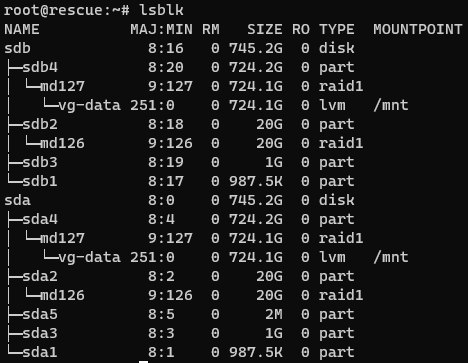

##### Scuro Guardiano's Document
---
# Coś się wyjebało przy update Proxmoxa - checklista

> 2 dni siedziałem nad zdiagnozowaniem problemu. Szukałem nie tam gdzie powinienem, przy okazji zrobiłem sporo błędów, czegoś co byłoby niewybaczalne na produkcji. Ale to nie było robione na produkcji więc we're good. Aczkolwiek byłoby mi bardzo smutno jakbym stracił te dane. Dodam, że nie zmarnowałbym aż 2 dni, gdyby zasrane IPMI od OVH działało.

Chcesz zrobić update z Proxmox 6 do Proxmox 7? Fajnie, ale najpierw zrób parę rzeczy:

1. Zrób kopię zapasową całego folderu `/etc`. Backup konfiguracji jest ważny i się w chuj przyda.
2. Zrób kopię zapasową folderu `/boot`, tak na wszelki wypadek ^^
3. Zrób kopię zapasową swoich danych.  
   > Na OVH dostajesz 100G miejsca na kopię, więc polecam skompresować dyski VMek, jeżeli dalej nie starczy no to cóż. Sadge, musisz coś poświęcić albo zapłacić za większą przestrzeń na backupy
4. Obejrzyj najpierw jak ktoś to robi, np tutaj: https://youtu.be/RCSp6gT7LWs

> Jak można się domyślić, ja tych rzeczy nie zrobiłem XD

## Shit happened, a nie zrobiłem kopii halp
W moim przypadku Proxmox po restarcie nie wstał. Podczas instalacji kliknąłem, żeby nadpisał konfigurację GRUB-a i myślałem, że rozwaliłem sobie bootloader. Ale nie, to nie był problem. Problemem były ****interfejsy sieciowe****. Na domiar złego z jakiegoś powodu IPMI nie działało mi, a że serwer mam na OVH to nie miałem absolutnie żadnego dostępu do serwera oprócz **resque**.

Omówmy sobie co zrobić kiedy się wyjebało.
> Założenie oprę o moją instancję, bo jest to trudniejszy przypadek.

1. Odpalamy sobie Resque, każdy serwis hostingowy powinien to oferować, a jak mamy self hosted shit to jakimś ISO się dobrać czy coś.
2. Jak jesteśmy w resque to najpierw raczej chcemy zrobić kopię zapasową configa. Musimy zlokalizować gdzie co jest. Robimy sobie komendę `lsblk`, która pokaże sktrukturę dysków. U mnie zrobiony był **_RAID 1_** i wyglądało to tak:

3. W moim przypadku na setupie z OVH i RAID 1 dane proxmoxa, czyli templatki i dyski VM-ek były na `/dev/md127`, wolumen o typie `lvm`, montowałem go za pomocą `mount /dev/vg/data /mnt`. Natomiast cały system proxmoxa z konfiguracją był na `/dev/md126` tego już normalnie montowałem za pomocą `mount /dev/md126 /mnt`.
4. Robimy kopię danych i możemy przejść do szukania problemu
5. ****WAŻNE!!! ZANIM UZNAMY, ŻE TO WINA BOOTLOADERA SPRAWDZAMY LOGI, BO MOŻE SIĘ OKAZAĆ, ŻE ZMARNUJEMY TYLKO CZAS****  
Wchodzimy sobie na nasz zmontowany dysk, tam gdzie jest zainstalowany cały system proxmoxa i wchodzimy sobie w `/mnt/var/log`. Tutaj powinien być plik `daemon.log`, zawiera on logi z systemd. Otwieramy go i bawimy się w detektywa. Jak są logi znaczy, że system się bootuje. Co możecie znaleźć to błąd sieci i tak było w moim przypadku.

## Naprawa interfejsów sieciowych
Co może się zdarzyć to wywalenie się interfejsu sieciowego z powodu zmian adresów MAC albo interfejsów. U mnie problemem były interfejsy, zmieniły się z `enp1s0` na `eth0` i z `enp2s0` na `eth1`. Żeby to naprawić to wpisujemy:
```
nano /etc/network/intefaces
```
I podmieniamy gdzie było `enp1s0` na `eth0`. Ewentualnie jak mamy interfejsy porozwane w folderze `interfaces.d` to musimy tam naprawiać. Proste.

## Naprawa GRUB-a
Nie mam sił pisać o tym, basically przy RAIDzie instalujecie na wszystkie dyski /dev/sdx, config ofc na roota. Zostawię kilka linków:
* [Pomoc na OVH](https://docs.ovh.com/pl/public-cloud/napraw-bootloader-grub/)
* [O Resque na OVH](https://support.us.ovhcloud.com/hc/en-us/articles/115001754490-How-to-Use-Rescue-Mode-on-a-Dedicated-Server)
* [Konfiguracja GRUBa z ArchWiki - opisane zaj**iście](https://wiki.archlinux.org/title/GRUB)

Spierdalam, I am out of this shit, chyba nie urodziłem się Sys Adminem.