##### Scuro Guardiano's Document
---
# Konfiguracja interfejsów sieciowych PROXMOX V6

> Jest to głównie tutorial dla przyszłego mnie, udostępniam, żeby może pomóc i zaoszczędzić trochę czasu jakiejś zbłąkanej w tym szajsie duszyczce (m.in. sobie z przyszłości), a więc forma tego tutka może nie być zbyt emm taka solidna. Nie piszę tego też dużo, więc wybaczcie.

# soyoustart/OVH
Wszystko konfigurowałem na serwerze dedykowanym od soyoustart (od OVH), więc część rzeczy tutaj robione pod ten serwer. Ale znajdą się tu przydatne ogólnie informację. Więc jazda.

# Konfiguracja poinstalacyjna
Po zainstalowaniu Proxmoxa trzeba skonfigurować parę rzeczy zanim zaczniemy zabawę, bo ludzie od OVH oczywiście spierdzielili i jak zrobicie reboot po instalce to interfejs sieciowy serwera nie wstanie, przyjdą technicy, odpalą serwer w rescue i dupa. Co zrobić w przypadku wywalenia interfejsu napiszę później.
## Autostart głównego interfejsu i ifupdown2
Więc tak, pierwsze co to wchodzimy w naszego dedyka w proxmoxie, zakładka System -> Sieć.  
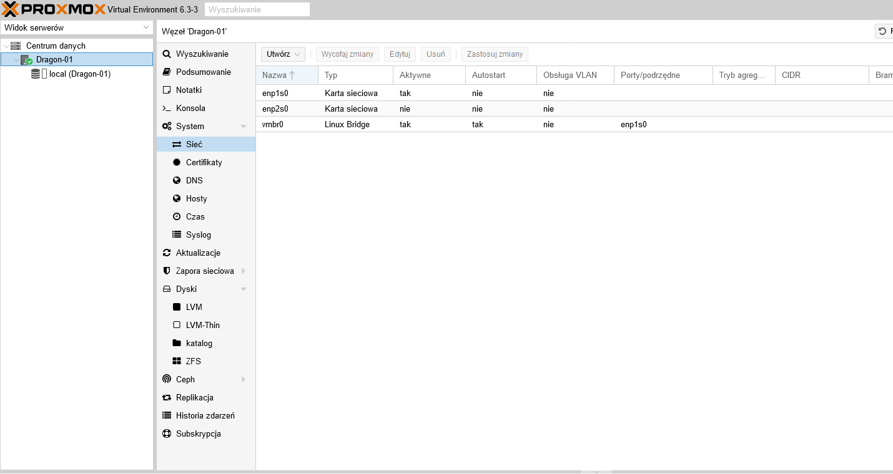  
* Co tutaj da się zauważyć, to że interfejs enp1s0 ma wyłączony autostart. Musimy go włączyć, inaczej w następnym kroku stracimy komunikację sieciową z serwerem.  
* Chciałoby się ustawić tutaj, ale nie. Zmiany nie zostaną zapisane, bo nie mamy pakietu ifupdown2, którego używa proxmox do konfiguracji sieci.
* Otwieramy konsolkę, **ALE NIE INSTALUJEMY JESZCZE PAKIETU IFUPDOWN2, BO INTERFEJS NIE WSTANIE**.
* Prawy na Dedyka [U mnie Dragon-01] i Konsola
* Wpisujemy ```nano /etc/network/interfaces```
* Przed interfejsem enp1s0 wpisujemy ```auto enp1s0``` jak na obrazku niżej  
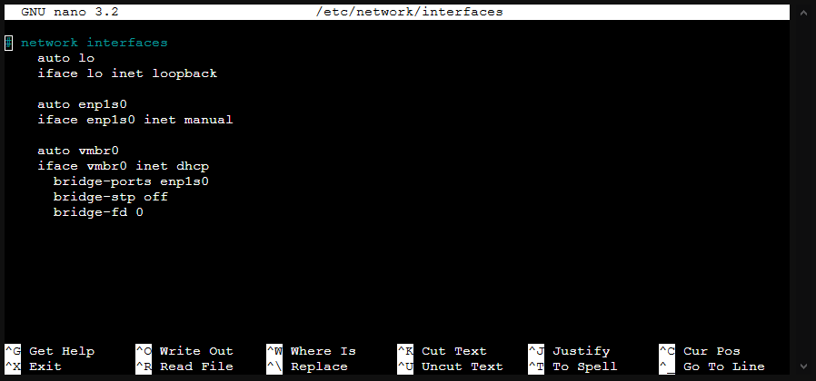  
* Zapisujemy ten szajs i **KOPIUJEMY ZAWARTOŚĆ /etc/network/interfaces I ZAPISUJEMY SOBIE GDZIEŚ NA SWOIM KOMPIE!!! JAK NETWORKING SERWERA SIĘ WYWALI, PRZYDA SIĘ NAM**
* Teraz instalujemy pakiet ifupdown2, chyba wiecie jak ;3 Podpowiem: Aptą.
* I próbowałem tego uniknąć, ale nie udało się, więc interfejs się wywali, wchodzimy w panel administracyjny i robimy Reboot serwera. I teraz gdybyśmy nie ustawili autostartu interfejsu enp1s0 to reboot by nie pomógł. Reboot trochę zajmuje, więc idziemy po kawunie.
* Reboot się udał, pacjent przeżył. Możemy przejść dalej.

# Tworzenie VM
## Krok 1 - Ściągamy obraz systemu!
Potrzebujemy stworzyć jakieś VMki, do podpinania pod nie interfejsów. Odpalamy konsolę serwera i pobieramy wgetem iso do ```/var/lib/vz/tempate/iso```. Ja do testów wybrałem [Debiana](https://www.debian.org/index.pl.html) bo instalacja jest deadly simple. Oczywiście do poważnych rzeczy użyję jedynego słusznego arcy distro Linuxa - Arch Linuxa ;)

## Krok 2 - Instalujemy tego Debiana!
* Click na górze Utwórz VM
* Wpisujesz nazwę i id sobie, klikasz next
* Wybierasz system, iso ściągnięte wcześniej  
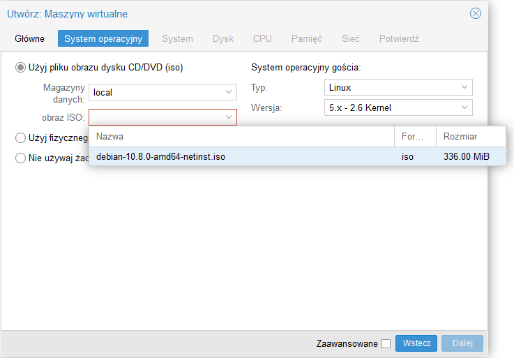  
* Ustawiasz sobie resztę ile chcesz, **Sieć zostawiasz na razie domyślnie**, ja przestawiam tylko na emulowanie **karty Intela**, żeby nie było problemów z sterownikami.  
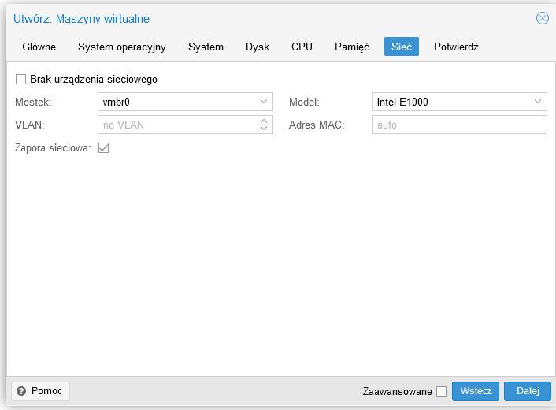  
* Po zakończeniu **NIE URUCHAMIASZ JESZCZE VM**

## Krok 3 - Interfejsy sieciowe

### Teraz skonfigurujemy interfejsy, tutaj mam dwie drogi - dodatkowe IP od providera oraz NAT, omówione w rozdziałach poniżej

---

# OVH IPFAILOVER - dodatkowe adresy IP od OVH
> Jeżeli bawisz się lokalnie albo na innym hostingu i ta sekcja Cię nie dotyczy, to możesz pominąć do następnej sekcji, gdzie będę tworzył NATa

> Przez OVH, mam na myśli również soyoustart

Dodajemy sobie u naszego usługodawcy IP, otrzymujemy IP i Wirtualny MAC  
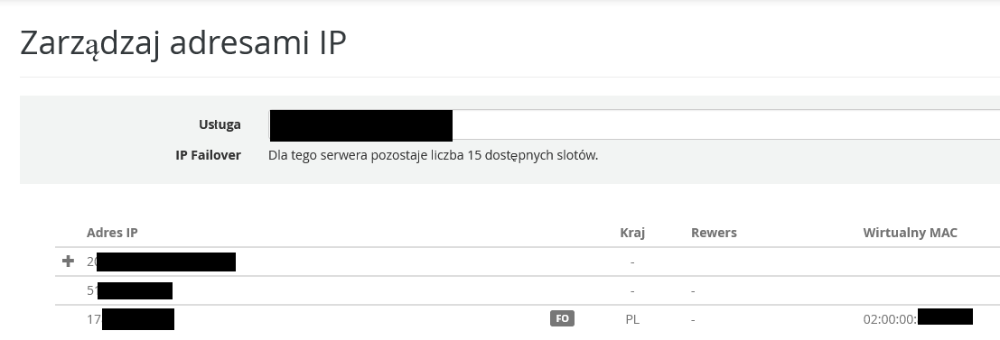  
Musiałem tutaj zamazać, bo nie mądrze jest dawać to co tutaj jest na public, więc...

## **_Załóżmy, że:_**
## IP Serwera to 75.748.86.91:  
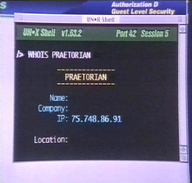  

## IP Failover to 23.75.345.200:  
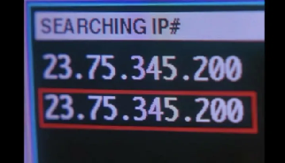  
###### Film - The Net 1995

### A nasz VMAC niech będzie ```02:00:00:ab:cd:ef```

### Lecimy z konfiguracją sieci VMki
1. Wchodzimy w zakładkę Sprzęt naszej VMki, i edytujemy interfejs sieciowy. Wpisujemy tutaj nasz vmac, resztę zostawiamy. Bridge musi być na vmbr0  
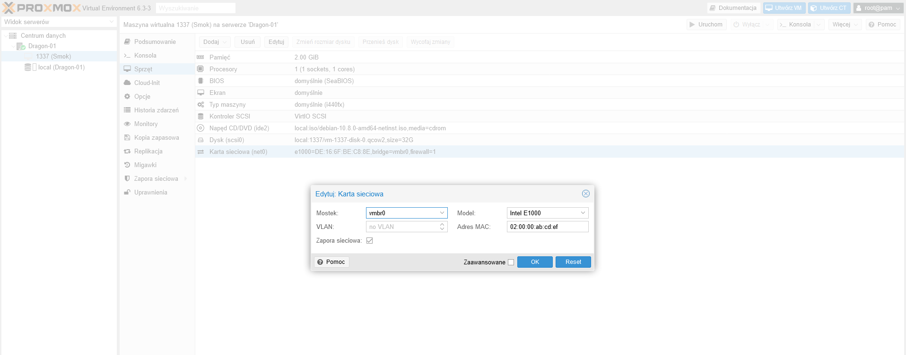  
2. Odpalamy VMkę i instalujemy system. Klikamy tam 2x na VM to odpali się okno noVNC.
3. Przy sieci się zatrzymujemy, wywali nam, że nie ma DHCP i trzeba ręcznie skonfigurować.
4. Adres IP wpisujemy nasz IP Failover w naszym przykładzie jest to (błędne zresztą) 23.75.345.200, maska 255.255.255.0
5. Adres Bramy wpisujemy pierwsze 3 oktety naszego ipfailover, a ostatni to 254 - dla na naszego przykładu to 23.75.345.254.
6. DNSa wpisujemy jakikolwiek DNS, ja wpisuję 1.1.1.1
7. Kontynuujemy, w trakcie graficznej Debiana dowiemy się, czy sieć działa. Jeżeli przy wyborze mirrora dla apty nie wywali błędu - sieć działa! Yay!
> UWAGA! Jest tutorial OVH do konfiguracji ipfailover, gdzie na adres bramy każą dać pierwsze 3 oktety IP dedyka i 254. Bull$hit, vmka nie dosięgnie bramy, nie są w tej samej sieci. Musi być na pierwsze 3 oktety IP Failover i 254 w ostatnim! Przynajmniej tak jest na soyoustart.
8. Jak pomyślnie dojdziemy do tego punktu w naszym instalatorze to sukces! Sieć działa.  
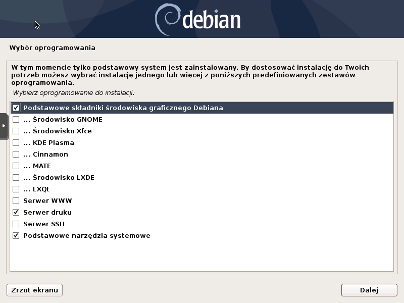  

# NAT
Opcja trudniejsza i dużo rzeczy może się spierdzielić, ale damy radę. Musimy utworzyć nowego bridge'a. 
1. Wchodzimy sobie w sieć naszego serwera dedykowane w proxmoxie i klikamy Utwórz -> Linux Bridge. Ja dam nazwę vmbr1, adres IP ustawiamy sobie dowolny prywatny IP, najlepiej z końcówką 1, ja dam 192.168.1.1.  
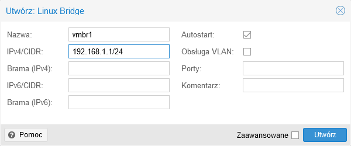  
2. Klikamy zastosuj zmiany i wchodzimy w konsolę serwera
3. Teraz musimy ustawić regułki iptables oraz aktywować ipforwarding. Te zmiany nie przetrwają reboota serwera, więc musimy co restart to robić. Są różne drogi, jakieś iptables persist i inne szajsy, ja po prostu dam post-up w interfejsie naszym vmbr1 (screen na końcu sekcji NAT). Więc tak:
    * Aktywacja IP Forwarding: ```echo 1 > /proc/sys/net/ipv4/ip_forward```
    * Ustawienie bridge'a: ```iptables -t nat -A POSTROUTING -s '192.168.1.0/24' -o vmbr0 -j MASQUERADE``` (vmbr0 to interfejs główny mojego serwera)
4. Jak wpisaliśmy to w post-up w interfejsach to wpiszmy ```ifup vmbr1```, jak w konsolce klepaliśmy to nie trzeba nic robić.
5. Wchodzimy w interfejs sieciowy naszej VMki i zmieniamy bridge'a na vmbr1  
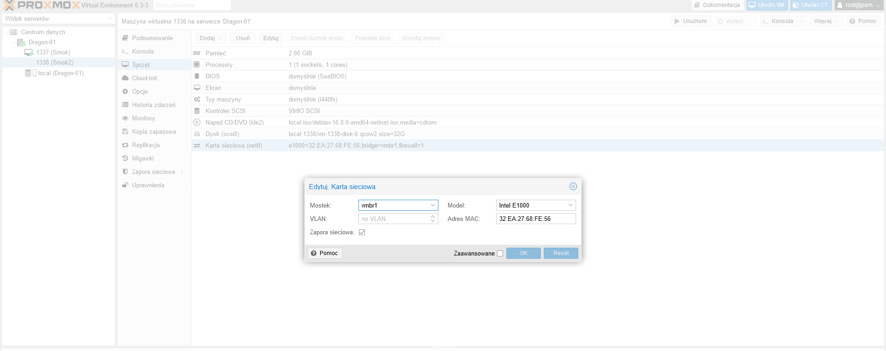  
6. Odpalamy VMkę i instalujemy system. Klikamy tam 2x na VM to odpali się okno noVNC.
7. Przy sieci się zatrzymujemy, wywali nam, że nie ma DHCP i trzeba ręcznie skonfigurować.
8. IP ustawiamy sobie na dowolne z naszej utworzonej sieci, ja dam 192.168.1.2, maska 255.255.255.0, brama to IP które daliśmy w nasz bridge, u mnie 192.168.1.1, DNSa ja daję 1.1.1.1, dajcie jakiego chcecie.
9. Jak wszystko poszło pomyślnie to podczas instalacji powinniśmy bez błędów dojść do tego ekranu. **Nie zapomnijcie zaznaczyć Serwera SSH ;)**  
  
10. Mamy neta yayx!!!
11. Ale to nie koniec...

## NAT PORT FORWARDING
Musimy teraz zrobić forward portów, żeby z zewnątrz dostać się do naszego np. ssh. Tak, zrobimy tutaj przekierowanie ssh z 192.168.1.2:22 na ipdedyka:666. Let's go!  
1. To są w sumie dwie komendy iptables, znowu ja to wewalę w post-up interfejsu, Wy (w tym przyszły ja) róbcie jak chcecie
2. ```iptables -A PREROUTING -t nat -i vmbr0 -p tcp --dport 666 -j DNAT --to-destination 192.168.1.2:22```
3. Jeżeli iptables akceptuje każdy forward, to tego nie trzeba: ```iptables -A FORWARD -p tcp -d 192.168.1.2 --dport 22 -j ACCEPT```
4. Teraz na komputerku sobie odpalamy ```ssh user@ipdedyka -p 666``` i połączymy się z naszą VMKą przez zforwardowany port.  
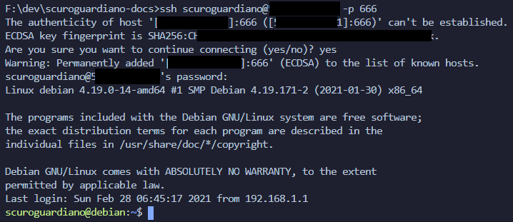  
5. I tyle! Mamy działający NAT, screen z mojego /etc/network/interfaces rn:  
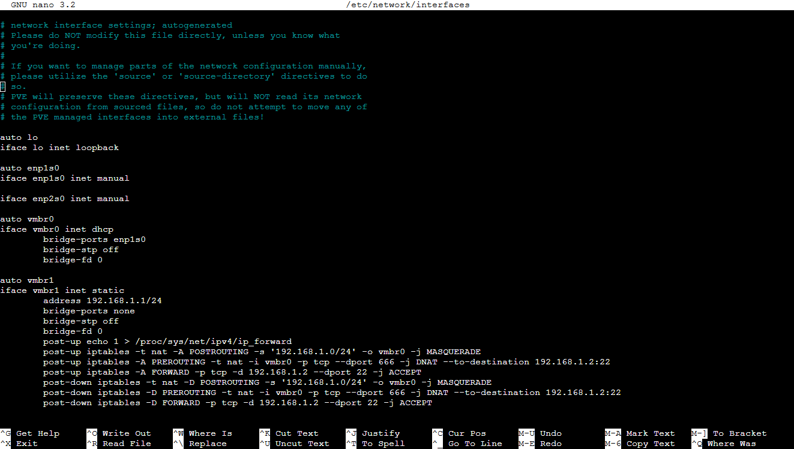  

## Problem z restartem networking
Jak zrestartujemy cały service networking, np. ```systemctl restart networking``` to wywalą się nam reguły na iptables. Nie pomoże usunięcie wszystkiego i wrzucenie reguł na nowo, nic oprócz reboota serwera dedykowanego. Nie wiem dlaczego, spędziłem kilka godzin szukając rozwiązania i ni ch... Najlepiej unikać restartu całego networking. Jak chcemy dać restatować to najlepiej pojedyńcze interfejsy za pomocą ifa.  
Druga rzecz, przy restarcie bridge'a (u mnie vmbr1) na dedyku sieć na maszynce przestanie działać. Trzeba zastosować metodę informatyczną, która (prawie) zawsze działa **wyłączyć i włączyć** maszynkę :) Tylko nie restart, wyłaczyć, poczekać aż VMka się wyłączy, a następnie właczyć.

# Co robić jak interfejs główny dedyka się wywali
Wpierdziele to tu później, jest 7 rano, idę spać.

# Koniec
To koniec mojego tutorialka, pewnie jak spojrzy ktoś kto w tym siedzi, to na myśl pewnie przyjdzie mu jedno wielkie XD, ale ja nie siedzę w sieciach, robiłem to pierwszy raz i spędziłem nad tym 3 dni, łącznie z 20h. Z tą wiedzą co mam teraz konfiguracja zajmuje kilkanaście minut. Może komuś oszczędzę błądzenia w ciemności (przyszłemu sobie na przykład ;3). Zdaję sobie sprawę, że to jest tylko wierzchołek góry lodowej, jeżeli chodzi o administrację serwerem dedykowanym albo o zabawę sieciami i mam nadzieję, że uda mi się nauczyć więcej, bo daje dużo satysfakcji kiedy w końcu ten szajs zaczyna działać i zaczynam rozumieć jak to działa, jak naprawiać błędy etc. Polecam każdemu zabawę albo na serwerze dedykowanym albo lokalnie z proxmoxem albo innym szajsem do wirtualizacji serwerowej. Od cholery można się nauczyć ^^

---
Copyright Scuro Guardiano 2021  